# hardengkec ☸️🪨🧭
hardengkec : Hardening GKE Cluster # PodSecurityPolicy 

## Objective
- Create a small GKE cluster using the default settings.
- Validate the most common paths of pod escape and cluster privilege escalation from the perspective of a malicious internal user.
- Harden the GKE cluster for these issues.
- Validate the cluster so that those actions are no longer allowed.
- These attack paths are relevant in the following scenarios:
    - An application flaw in an external facing pod that allows for Server-Side Request Forgery (SSRF) attacks.
    - A fully compromised container inside a pod allowing for Remote Command Execution (RCE).
    - A malicious internal user or an attacker with a set of compromised internal user credentials with the ability to create/update a pod in a given namespace.
- Understand the available controls
    - Disabling the Legacy Compute Engine Metadata API Endpoint - By specifying a custom metadata key and value, the v1beta1 metadata endpoint will no longer be available from the instance.
    - Enable Metadata Concealment - Passing an additional configuration during cluster and/or node pool creation, a lightweight proxy will be installed on each node that proxies all requests to the Metadata API and prevents access to sensitive endpoints.
    - Enable and Utilize Pod Security Admission - Enable the Pod Security Admission (PSA) controller in your GKE cluster. This provides the ability to enforce pod security standards that enhance your cluster's security posture.

## Hardening Default GKE Cluster Configurations

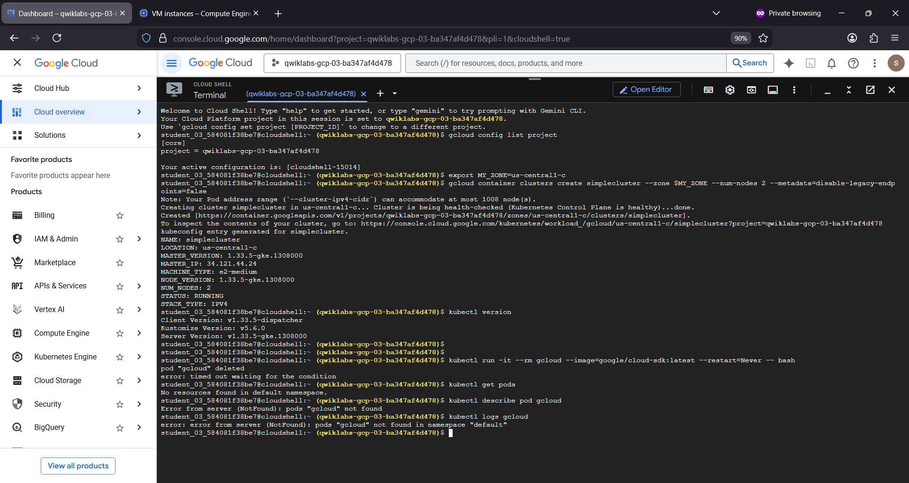

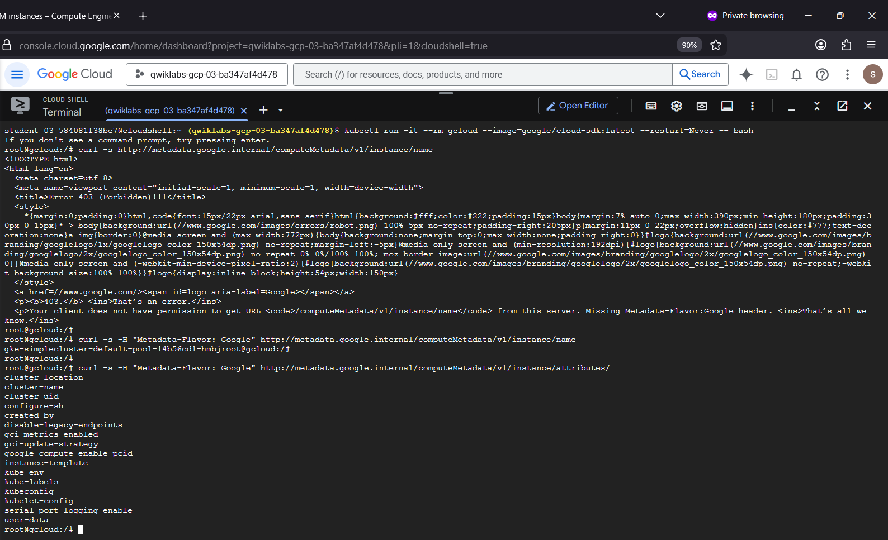

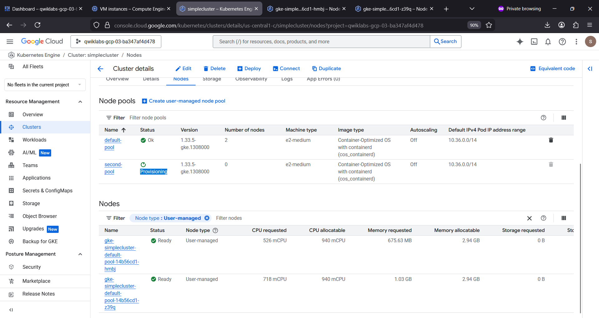

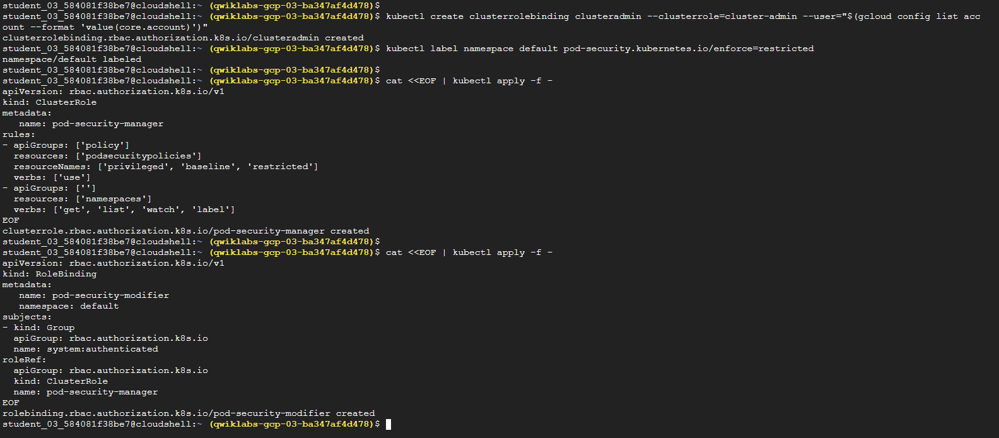

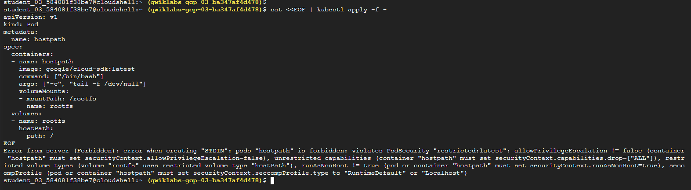

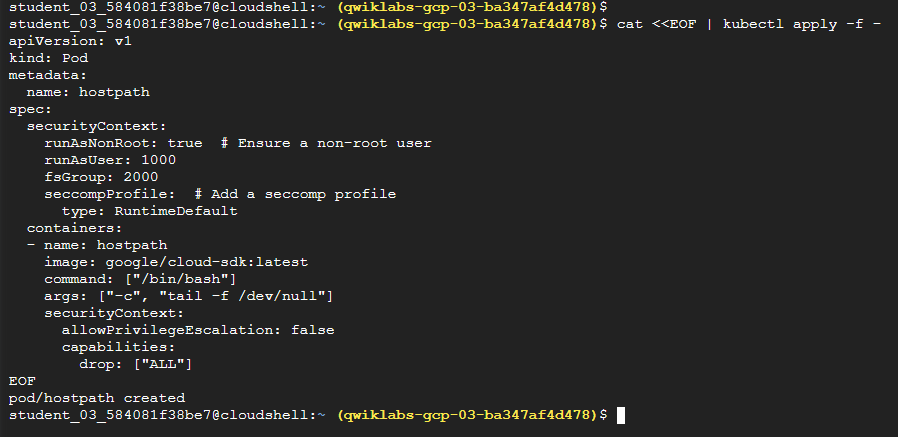

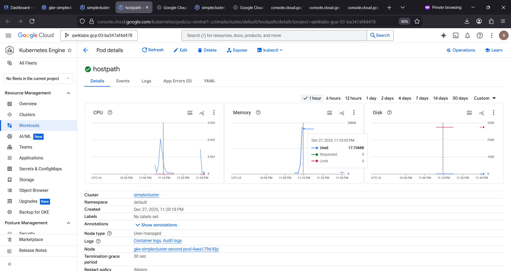

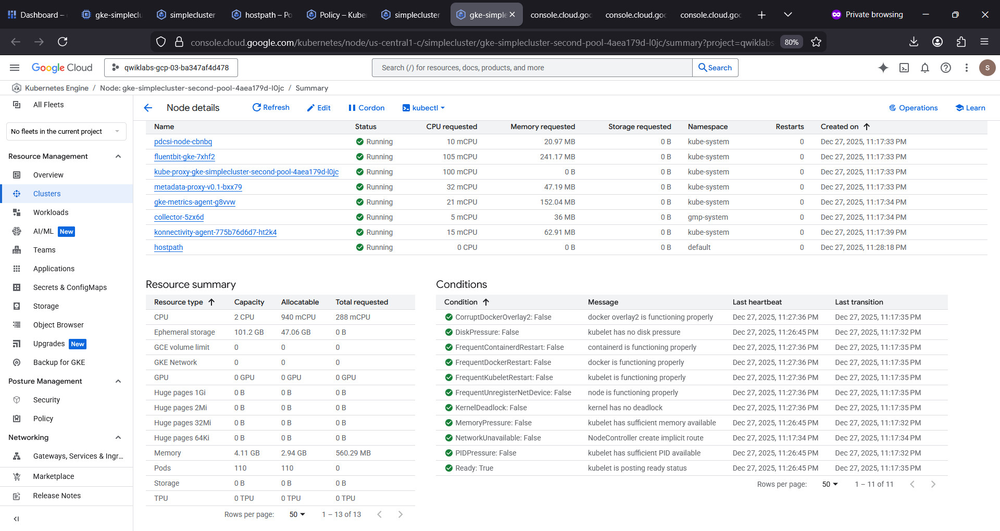

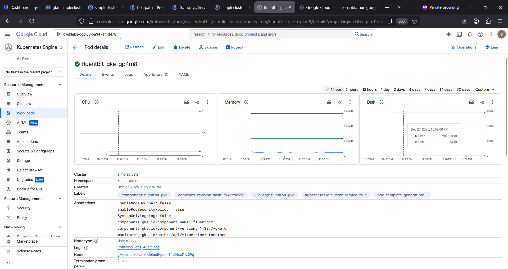

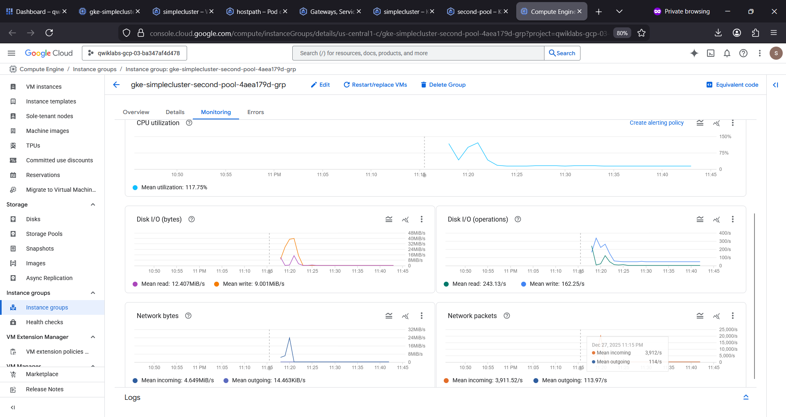

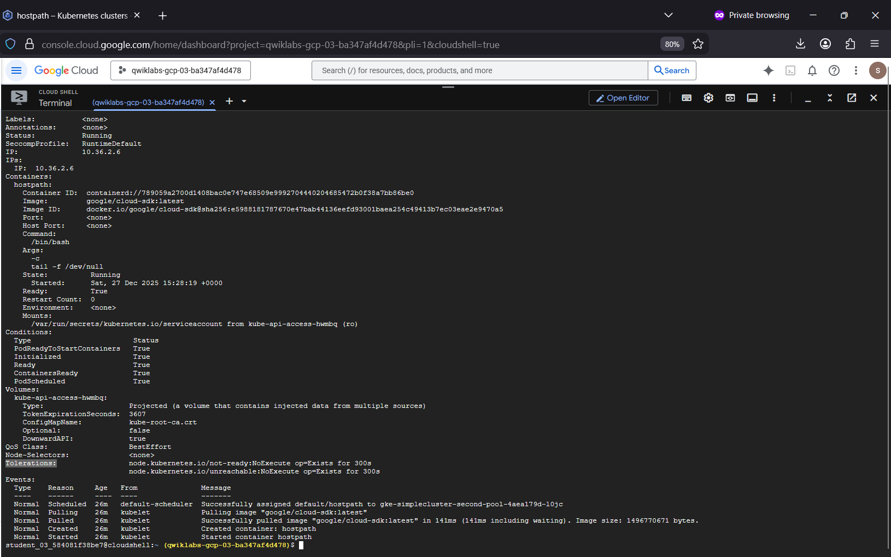

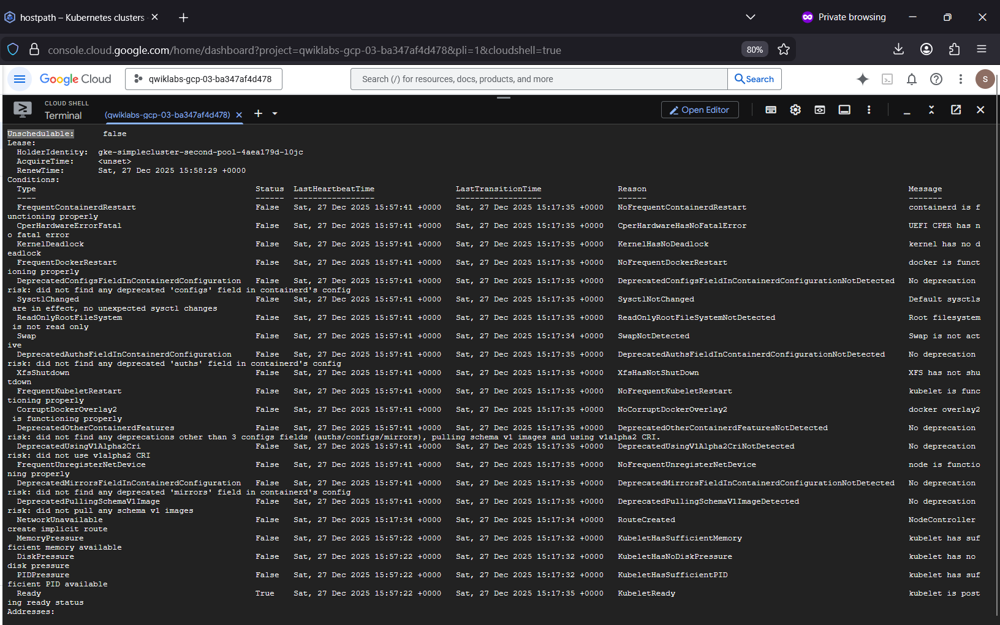

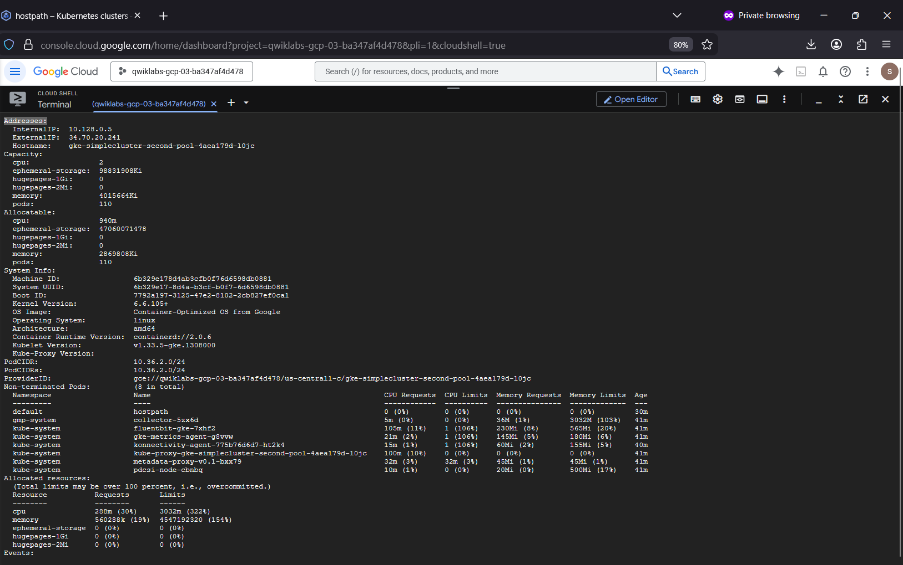

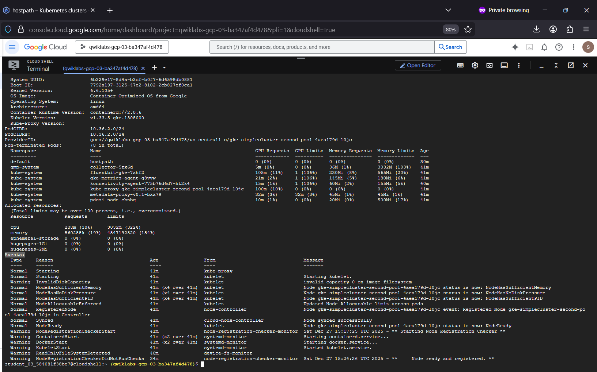

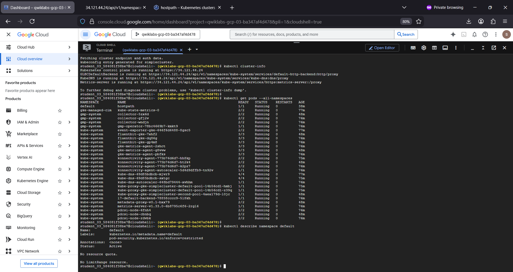

